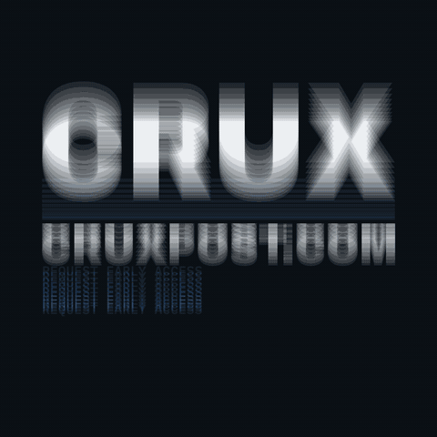
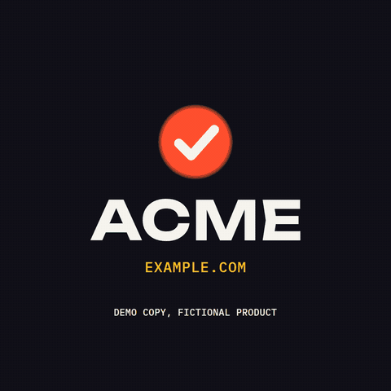
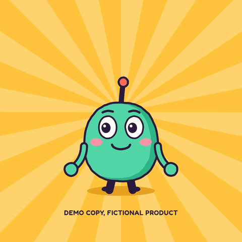
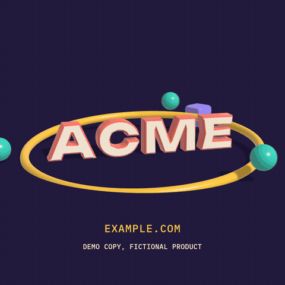
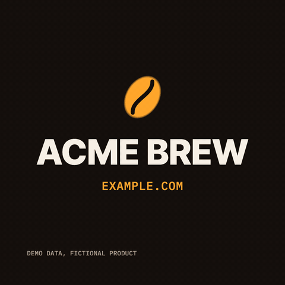
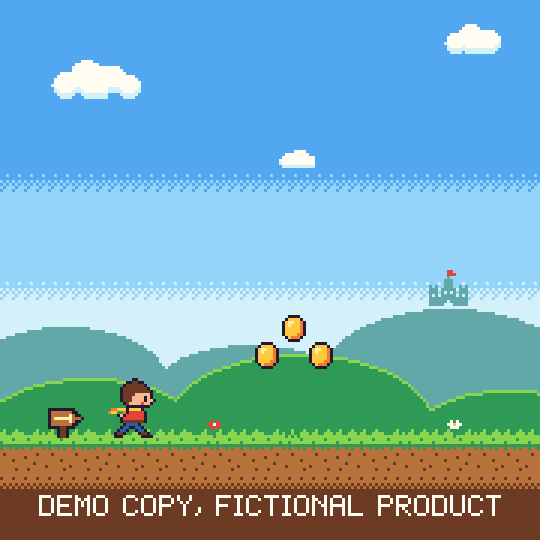
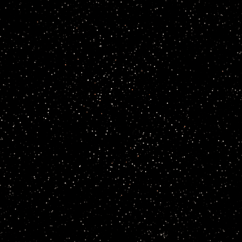

# motion-launch-videos

Short, looping launch videos made in code with Claude Code, in eight styles: kinetic type, flat shapes, cartoons, 3D, data charts, pixel art, particles and app UI. Each film is one self-contained HTML file that can draw any frame from the time alone, rendered to MP4 with real motion blur and a seamless loop that is checked, not hoped for.

| | |
|---|---|
|  **Kinetic type** ([motion-launch-videos](plugins/motion-launch-videos/skills/motion-launch-videos/SKILL.md)): big type on springs, misregistration, mask wipes. [Example](examples/crux-launch/) |  **Shapes** ([motion-shapes](plugins/motion-launch-videos/skills/motion-shapes/SKILL.md)): icons that draw on, pop and ripple, wipes, SVG logos. [Example](examples/shapes-acme-tasks/) |
|  **Cartoon** ([motion-cartoon](plugins/motion-launch-videos/skills/motion-cartoon/SKILL.md)): an original mascot, on twos, with a boiling line. [Example](examples/cartoon-pip/) |  **3D** ([motion-3d](plugins/motion-launch-videos/skills/motion-3d/SKILL.md)): extruded type and logos, soft shadows, a moving camera. [Example](examples/3d-acme/) |
|  **Charts** ([motion-charts](plugins/motion-launch-videos/skills/motion-charts/SKILL.md)): counters, bars, lines and donuts from sourced data. [Example](examples/charts-acme-brew/) |  **Pixel art** ([motion-pixel](plugins/motion-launch-videos/skills/motion-pixel/SKILL.md)): sprites, parallax, a bitmap font, a strict palette. [Example](examples/pixel-acme-quest/) |
|  **Particles** ([motion-particles](plugins/motion-launch-videos/skills/motion-particles/SKILL.md)): swarms that form words and logos. [Example](examples/particles-acme-signal/) |  **App UI** ([motion-ui](plugins/motion-launch-videos/skills/motion-ui/SKILL.md)): taps, pushes and toasts in a device frame. [Example](examples/ui-acme-trips/) |

The Crux film is a real launch bumper for the author's product: every word on screen is taken from the live site, with sources in its [BRIEF.md](examples/crux-launch/BRIEF.md). The other seven are each skill's own demo, for fictional products, and say so on screen.

You give it a product and what the film should say, or just a URL, and a style if you have one in mind. Claude reads the product's site, writes 3 to 5 beats of at most four words each, designs every beat on the tempo grid, and writes the whole film as one HTML page. Then it checks the film with the skill's automated critique, renders it frame by frame, and verifies the MP4 it delivers.

## The skills

| Skill | Makes | Ask for it like |
|---|---|---|
| `motion-launch-videos` | a kinetic-typography bumper or identity sting | "Make a 12 second launch bumper for https://example.com" |
| `motion-shapes` | flat 2D motion graphics: icons, draw-ons, ripples, wipes, an animated SVG logo | "Animate our logo drawing itself on", "An explainer-style loop for our three features" |
| `motion-cartoon` | an original mascot that notices you, hops, waves, talks and shows the product's name | "Make a cartoon mascot saying hi for our app" |
| `motion-3d` | extruded 3D type or a 3D logo with primitives, soft shadows and a moving camera | "Make a 3D sting of our wordmark" |
| `motion-charts` | animated charts from sourced data: counters, bars, lines, donuts | "Animate these numbers from our launch post" |
| `motion-pixel` | pixel-art loops: sprites, tiles, parallax, a bitmap font | "A retro 8-bit teaser for our game" |
| `motion-particles` | particle swarms that form words and logos, burst and reform | "A particle reveal of our name" |
| `motion-ui` | app and product UI demos in a device frame, with callouts | "An app-store style preview of our booking flow" |

All eight share the same rules: true claims only, with every word traced to the product's own pages in `BRIEF.md`; nothing that is not the user's to use (no other company's logo or character); four words a beat; one file with nothing loaded over the network; and a look at the frames before anything ships.

## Install

As a plugin, from this repo's marketplace (run these inside Claude Code):

```
/plugin marketplace add Kimeur/motion-launch-videos
/plugin install motion-launch-videos@motion-launch-videos
```

That installs all eight skills; Claude picks the one that fits your request, or you can ask for one by name.

Without the plugin system, clone the repo and put the skills you want where Claude Code looks for personal skills (each skill folder is self-contained):

```bash
git clone https://github.com/Kimeur/motion-launch-videos
mkdir -p ~/.claude/skills
cp -R motion-launch-videos/plugins/motion-launch-videos/skills/motion-* ~/.claude/skills/
```

For a whole team, check the same folders into the project as `.claude/skills/<skill>/` instead.

## Requirements

- **Node 20 or newer.** The scripts need one package, `playwright-core`. Add it to your project once with `npm i -D playwright-core` (it serves every skill and survives plugin updates), or Claude installs it next to a skill's scripts with `npm install --prefix <skill folder> --no-package-lock`. Nothing is installed globally.
- **ffmpeg and ffprobe** with libx264 (`brew install ffmpeg`, `apt install ffmpeg`).
- **A Chromium.** Any of: `CHROME_PATH`, a Chromium already in the Playwright cache, a system Google Chrome, or the one playwright-core installs. The 3D skill uses WebGL2: the GPU when there is one, Chromium's software renderer when there is not.
- **Network access** once per film, to fetch its fonts from the npm registry.

`node <skill folder>/scripts/render.mjs doctor` checks all of this and prints the exact command for anything missing.

## Use

Ask for a film in plain words, from inside your project. Every skill works the same way:

1. **Brief.** It reads the live site, asks at most one round of questions (message, format, duration, palette) or uses the defaults, and writes `videos/<film>/BRIEF.md` with every fact and the URL it came from. No prices or numbers the site does not show. A product with no site (a demo, a fictional or unreleased product) takes its words from your brief only and says so on screen.
2. **Copy.** Hook, what it does, proof, call to action: at most four words a beat, one CTA, in the product's own words. The cartoon skill writes a performance; the chart skill a sourced data table.
3. **Design spec.** `videos/<film>/DESIGN.md`: the grid, palette roles with contrast ratios, type roles, and every beat's elements, springs and transitions on a 120 BPM grid, and how the loop closes.
4. **Build.** It copies the skill's template, fills in its `FILM` config, fetches the fonts, and builds one self-contained `videos/<film>/<film>.html`.
5. **Critique.** Review stills and a contact sheet, plus the skill's automated checks (glyph coverage, words per beat, live area, contrast, palette, the loop, and the style's own: letter gaps for type, sourced numbers for charts, a strict palette for pixel art, the face at the loop point for a cartoon). It fixes what fails and looks again.
6. **Render and verify.** A loop check, then the MP4, a preview GIF and a poster, then ffprobe facts, colour tags, and decoded frames compared with the canvas and looked at.

### 30-second quick start

Every template runs as it is: a demo for a fictional product. For example, the cartoon:

```bash
git clone https://github.com/Kimeur/motion-launch-videos && cd motion-launch-videos
S=plugins/motion-launch-videos/skills/motion-cartoon      # or motion-shapes, motion-3d, motion-charts, ...
npm install --prefix $S --no-package-lock
node $S/scripts/render.mjs doctor                  # everything in place? prints the fix if not
mkdir -p videos/demo/src && cp $S/templates/film.html videos/demo/src/film.html
node $S/scripts/fonts.mjs videos/demo              # fetches the faces the template names
node $S/scripts/render.mjs stills videos/demo      # critique + stills/contact.png
node $S/scripts/render.mjs loopcheck videos/demo   # the seam and purity
node $S/scripts/render.mjs render videos/demo      # renders/demo.mp4, preview.gif, poster.png
node $S/scripts/render.mjs verify videos/demo      # ffprobe facts and decoded pixels
```

Open `videos/demo/demo.html` in Chrome to preview it: Space pauses, the arrow keys step one frame.

## How it works

- **One file, one clock.** The film is a canvas page whose `seek(t)` draws any moment from `t` alone: no timers, no `Date`, no `Math.random`, no state between frames. Layout and geometry are measured once after the fonts load. Fonts are embedded as base64; the page loads nothing over the network.
- **Closed-form springs.** Every move is a sum of damped springs evaluated in closed form, one per target change, snapped to exactly 1 once settled, so any frame can be drawn on its own. In a looping film, a spring still settling at the end carries over the seam.
- **Two kinds of loop, both checked.** A *hold* loop ends on a still copy of frame 0 (the lockup), and `loopcheck` requires every pixel of the seam to match. A *cycle* loop never stops (a spinning ring, a mascot's breath, a scrolling landscape): every periodic motion runs a whole number of cycles, every value returns, and `loopcheck` requires the seam to be as smooth as any other instant.
- **Real motion blur.** Each frame averages 1 to 64 subframes sampled behind it on a 270-degree shutter, one per 5 px of movement, and never across a hard cut. Cartoons and pixel art switch it off and animate on held drawings instead.
- **A shared core, eight engines.** Every skill's template is the same core (springs, loops, motion blur, type layout, the critique's plumbing, the page's API) plus an engine for its style: per-glyph kinetic type; shapes with trims, morphs and repeaters; a cartoon rig with squash and stretch; a WebGL2 renderer with extruded type and soft shadows; charts; pixel sprites; particle formations; UI components.
- **Checked output.** H.264 with BT.709 colour tags in the stream, faststart, exact frame count, and decoded frames (with an exact, not a fast, YUV-to-RGB conversion) compared with the canvas pixels.

## What's inside

```
plugins/motion-launch-videos/skills/
├── motion-launch-videos/   kinetic type (its own engine and docs)
├── motion-shapes/          flat 2D motion graphics
├── motion-cartoon/         cartoon character loops
├── motion-3d/              3D type, logos and primitives (WebGL2)
├── motion-charts/          animated data charts
├── motion-pixel/           pixel-art loops
├── motion-particles/       particle swarms
└── motion-ui/              app UI demos
    each: SKILL.md, package.json (playwright-core),
          reference/ (the style's engine, craft and review docs, plus the shared brief, core, loops, springs, render, fonts),
          templates/ (film.html: FILM config + core + engine, runnable as a demo; BRIEF.md; DESIGN.md),
          scripts/   (fonts.mjs, build.mjs, render.mjs: doctor | stills | loopcheck | render | verify | mp4frames | at | frame | layout, cmap.mjs)
examples/                   one rendered film per skill: brief, spec, source, built HTML, MP4, GIF, poster, font licences
shared/                     the single source of the core, the scripts and the shared docs
tools/                      sync.mjs (copies shared/ into every skill) and check.mjs (repo checks, --smoke renders every demo's checks)
```

## For maintainers

The core runtime (`shared/core.js`), the scripts (`shared/scripts/`) and the shared docs (`shared/reference/`, `shared/templates/`) have one source each. `node tools/sync.mjs` copies them into every skill, so each skill folder stays self-contained for anyone who copies just one. `node tools/check.mjs` checks that everything is in sync, the manifests and every `SKILL.md`, and that every template parses; `node tools/check.mjs --smoke` also builds each skill's demo and runs its critique and loopcheck.

## Credits

- Fonts, all under the SIL Open Font License 1.1, via [Fontsource](https://fontsource.org): [Archivo Black](https://github.com/Omnibus-Type/ArchivoBlack), [Syne](https://gitlab.com/bonjour-monde/fonderie/syne-typeface), [IBM Plex Mono](https://github.com/IBM/plex), [Unbounded](https://github.com/googlefonts/unbounded), [Lilita One](https://fonts.google.com/specimen/Lilita+One), [Fredoka](https://github.com/hafontia/Fredoka-One) and the faces the other examples name in their `OFL/` folders. The skills ship no font files: `fonts.mjs` fetches them for each film. Each example's built HTML embeds its fonts, and their licence texts are in that example's `OFL/` folder.

## License

The skills' code and documentation are under the MIT licence ([LICENSE](LICENSE)). The fonts are not covered by it: they stay under the SIL OFL 1.1.
